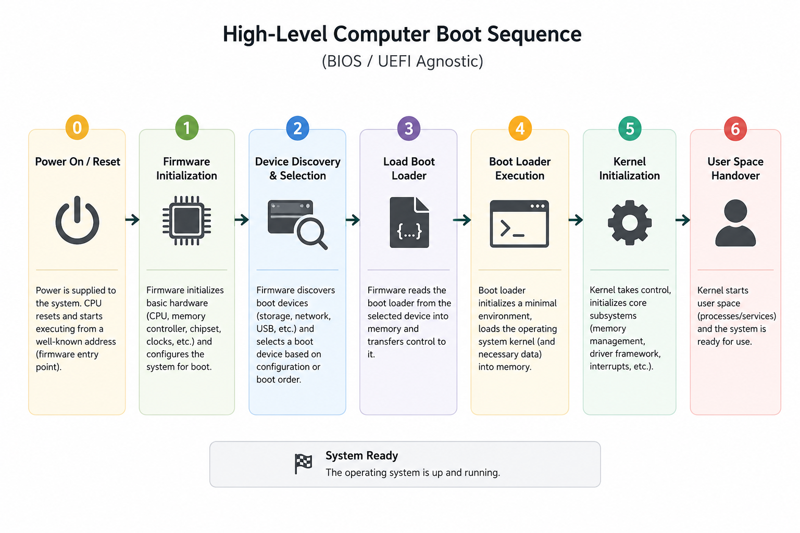

# UEFI and How Computers Boot

Now let's see what UEFI is, where it sits in the boot process, and why is it better than the older **BIOS** boot.

### First, let's understand how computers boot

The overall flow of how a computer boots is as follows.



In this diagram, you can see the flow of the boot process.

As soon as the power is turned on, a special software stored in non volatile storage in the motherboard, starts running.

This software is generally called **Firmware**.

The job of the firmware is varied but in the scope of this documentation, it can be assumed, its job as helping the OS boot.

This is where **our guy UEFI** and his elder brother **BIOS** come into picture. Let's explore how these firmware specifications help us boot an OS.

---

## BIOS

BIOS (Basic Input/Output System) was the older standard of firmware. It works with MBRs (Master Boot Records) in the disks.

Here is the basic high level flow of how BIOS starts:

> **Power on**
>
> ↓
>
> **CPU program counter points to the BIOS Flash storage**
>
> *(To be precise here, when a CPU resets, like when in reboots or when it starts executing, the CPU starts from the memory address in his reset vector)*
>
> ↓
>
> **BIOS gets executed by the CPU**
>
> *(It is awesome right, the CPU doesn't care if it is a Flash storage or DRAM, all it does is ask the memory bus, the byte in the memory address in his registers)*
>
> ↓
>
> **BIOS Reads the boot order from his NVRAM**
>
> *(Oooo, NVRAM, What is it? It is nothing but a fancy way of saying Non Volatile Random Access Memory, which may sound like an oxymoron, but no, RAM need not strictly be volatile, RAM is random access memory, it doesn't care if it volatile or not. In earlier days, BIOS used to have a CMOS RAM, instead of NVRAMs)*
>
> ↓
>
> **BIOS reads the first 512 bytes (MBR) from the first boot device (or the device that it takes if the previous devices fail)**
>
> *These 512 bytes are explained below in detail.*

---

### MBRs

The **512 Bytes** the BIOS reads is called the **Master Boot Record**.

The layout is as follows:

| Size | Purpose |
| :--- | :------ |
| **446 Bytes** | Bootloader Code (**Your Bootloader !!!**) |
| **64 Bytes** | Partition table (4 x 16 Bytes) |
| **2 Bytes** | Boot signature |

This **Boot signature** tells BIOS that this is indeed an MBR.

The **446-byte bootloader** is then executed by the CPU. Since **446 bytes** is far too small to load an operating system, this tiny bootloader usually loads a larger **second-stage bootloader**, which eventually loads the operating system.

---

### Where is the MBR placed in memory?

The BIOS loads the MBR into the memory location **0x7c00** and the bootloaders that are written for BIOS are expected to assume themselves starting from the same address.

---

### So what was the problem with BIOS?

BIOS traditionally booted from MBR-partitioned disks, which made MBR's limitations effectively BIOS limitations.

The first problem was that, MBR actually only supports 4 partition only in your drive.

Actually this is not strictly true in the case of Extended Boot Records (EBRs) in Extended partitions.

<details>

<summary><strong>Only if you want to know how Extended partitions solve 4 partition issue</strong></summary>

Extended Partitons are special type of Partition in the MBR partition scheme that has a partition table at the first sector, this first sector is called the Extended Boot Record (EBR).

The same Boot signature is present in the EBR as well.

The Bootloader can read this partition detail in the EBR to extend the MBR's partition limitation.

</details>

<br/>

<details>

<summary><strong>Can't BIOS read GPT partitioning (The newer standard)?</strong></summary>

The answer is, it can because the GPT partitioning still makes the first sector an MBR like one called protective MBR sector.

The bootloader might not have enough space so there would be a BIOS Boot partition (a small one), to accommodate a second-stage bootloader.

So BIOS can still boot from a GPT device as well, given if the arrangements are done.

</details>

In the case of BIOS, the bootloader needs to take care of switching the CPU modes, load the GDT, set up paging etc.

Basically the BIOS reads the sector and hands the control over the bootloader with minimal support and services.

There are multiple other limitations in this system, which are out of the scope of this document.

---

## UEFI (Unified Extensible Firmware Interface)

Now we have reached the actual star of the show, **UEFI**.

Before we start reading about him, let's understand the situation.

People started noticing the limitations of BIOS. BIOS would just read the first **512 bytes** from the MBR and execute the code in the bootloader section. That's it.

The bootloader had to heavy-lift CPU mode changes, set up the **GDT**, enable **paging**, and provide the services required to let the kernel boot.

And engineers were like,

> **BRO WE COULD DO BETTER.**

They wanted a firmware that eases the pain off of a poor bootloader.

So we got **UEFI**, which is essentially a mini operating system running at the firmware level.

Let's first see what problems UEFI solved.

| Aspect | UEFI | BIOS |
| :----- | :--- | :--- |
| CPU execution environment | Starts the bootloader in 32-bit or 64-bit protected mode (architecture dependent) | Starts the bootloader in 16-bit real mode |
| Initial memory management | Provides a flat memory model and firmware-managed page tables (on x86-64) | Bootloader must establish its own protected mode, paging, and memory management |
| GDT setup | Firmware initializes an execution environment suitable for EFI applications | Bootloader is responsible for setting up the GDT before entering protected mode |
| Firmware services | Provides Boot Services and Runtime Services through standardized APIs | Provides only legacy BIOS interrupt services (INT 10h, INT 13h, etc.) |
| Device access | Standardized firmware protocols and drivers | Legacy BIOS interrupt interfaces with limited capabilities |
| Responsibility for OS loading | Firmware loads an EFI executable from the EFI System Partition | Bootloader code in the MBR (or later stages) locates and loads the operating system |

> Detailed explanations of concepts like **CPU Modes**, **Paging**, **GDT**, **Runtime Services**, and **Boot Services** will be covered separately in the **Blogs** section *(Coming Soon)*.

---

#### Now, how does UEFI help in easing my boot process?

As per the above table, UEFI takes care of most of the things that were once the responsibility of the bootloader itself.

Instead of caring about switching from **16-bit** mode to **32-bit** and **64-bit** modes, setting up memory management, enabling paging, and so on, UEFI does all of that before handing control over to our bootloader.

So after UEFI, the bootloader can actually take care of only what its name may suggest—**loading the boot media, which is the kernel.**

---

#### Ok, BIOS took the bootloader from the MBR. Where does UEFI find its bootloader?

This is a nice question, and the answer is very interesting.

Remember we called UEFI a mini OS on itself?

Well, UEFI can actually read filesystems.

> **YES, THE FIRMWARE READS AN ACTUAL FILESYSTEM.**

Most UEFI implementations include drivers for **FAT12**, **FAT16**, and **FAT32**. This is why the **EFI System Partition (ESP)** is formatted as **FAT32**.

You can even see a partition named **EFI System Partition** on your disk if your machine boots using UEFI.

---

#### Ok, it reads FAT32. But how does UEFI know where to look? Filesystems make a brute-force search improbable, right?

Exactly.

UEFI doesn't brute-force search the filesystem to locate a bootloader.

Remember the **NVRAM** we said BIOS uses for storing the boot order? The same NVRAM plays an important role here as well.

The firmware stores **boot entries** in its NVRAM. Each entry contains:

- The disk to boot from.
- The EFI System Partition on that disk.
- The path to the EFI executable.
- The boot priority.

A simplified example looks like this:

| Boot Order | Device | Location to look for |
| :--------- | :----- | :------------------- |
| 1 | NVMe SSD | `EFI/NINUX/BOOT.EFI` |
| 2 | SATA HDD | `EFI/UBUNTU/BOOT.EFI` |

So the firmware essentially remembers **where to look** inside each EFI System Partition.

If no explicit boot entry exists (commonly on removable media like USB drives), UEFI falls back to the default path:

```text
EFI/BOOT/BOOTX64.EFI
```

---

#### So UEFI can read a bootloader from the filesystem? How does that make our life better?

The first major advantage is that UEFI bootloaders are **not limited by the 446-byte size limit** of a BIOS first-stage bootloader.

You don't have to worry about memory size limitations while writing your bootloader.

Unlike BIOS, UEFI doesn't care whether your bootloader is **20 KB** or **2 MB**.

As long as it is a valid EFI application located through a boot entry (or the fallback path), the firmware will load and execute it.

---

#### More on UEFI bootloaders

These bootloaders are written and compiled as **PE/COFF binaries** (basically the same format as the `.exe` files lying around on your Windows machine).

So your **GRUB** that lets you choose the operating system in your dual-boot setup is actually an **executable (PE/COFF)**, not a Linux-style **ELF** binary.

Since an EFI bootloader is just another executable, you can even write one in **C**, **C++**, or **Rust**, link it as a **PE/COFF** binary, place it inside the **EFI System Partition**, and let UEFI execute it.